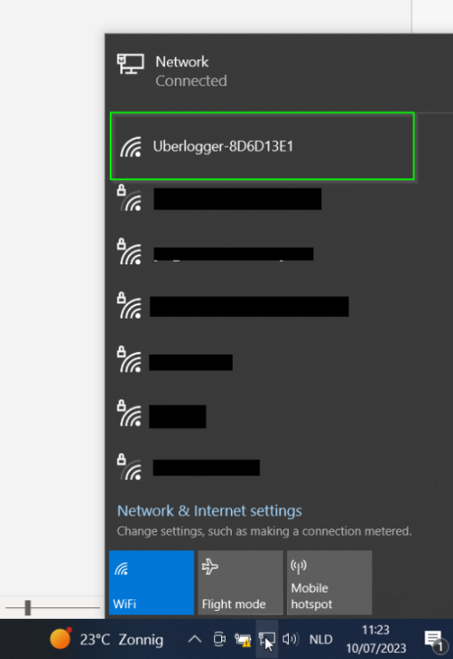
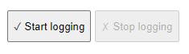
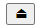

# Quickstart

## Power Up

Connect the provided USB-C cable into the Uberlogger and plug the other
end into your PC or a USB charger that provides 5V and at least 300 mA.
Flip the power switch to \'on\' and you should see a green LED light up.
Switch the power switch to the 'on' state. The green LED should turn on.

Figure 1: connecting the Uberlogger with the USB connector.

## Connect to Wi-Fi & accessing the portal.

From your PC, connect to the Wi-Fi network that reads as
"Uberlogger-XXXXXXXX," where \'XXXXXXXX\' represents your unique
Uberlogger ID.

<figure>
  
  <figcaption>Figure 2: Connecting with the Uberlogger over Wi-Fi. Note that you should see the network Uberlogger-XXXXXXXX with XXXXXXXX is unique for your Uberlogger.</figcaption>
</figure>

Once connected, open your preferred browser, and navigate to
[http://192.168.4.1](http://192.168.4.1/). You should now be viewing the
Uberlogger live data page.

## Starting and stopping logging

Put an SD card formatted as FAT partition into the SD card slot on your
Uberlogger.

:::info[Note]

Currently only SD cards up to 32GB and FAT are supported.

:::

---

- **Start logging** Start the logger by either:

  1.  Pressing the "mode" button on the side of the Uberlogger for
      about 1 second to start logging.

  2.  Pressing "Start logging" on the top right corner of the user
      interface:

> 

3.  Going to the "Logging" tab inside the and click on "Start logging":

> 
>
> The green LED on the Uberlogger should blink at an interval of around
> 1 second to indicate it is logging.

- **Stop Logging**: When you are done, you can stop logging by:

  1.  Pressing the mode button for 1 second

  2.  Pressing the stop logging button in the top right corner:

> 

3.  Clicking "Stop logging" under the \"Logging\" tab:

> 

## Retrieve your data

Your logged data can be retrieved in the following way.

4.  **Ejecting the SD card:** before you can eject your SD card, you
    need to unmount the SD card by hitting the "eject" button at the top
    of the page or by pressing "unmount" on the "Logging tab." . You can
    only unmount while not logging.

---

---

After this you can insert the SD card into a PC and retrieve the data
from there.

---

:::danger[Important]
Do not manually eject the SD-card while the
SD-card is mounted and/or while logging. Failing to do so may
corrupt your data!
:::

---

5.  **Using the file browser:** you can download the csv from the file
    browser which can be found under the \"Logging" tab.

# Connecting inputs

## Analog inputs

For analog inputs, connect to AINx and its corresponding GND.

Figure 3: analog inputs. Each analog input has a ground signal indicated
as GND opposite of the signal as indicated in the figure.

You can connect the analog channel to AINx and its corresponding GND,
which is opposite of the positive terminal as indicated above in red.
The GND and AINx terminal can handle voltages up to\
--60V and +60V, respectively. You can insert the wire in the screw
terminal by first screwing the terminal open, inserting the wire and
then screwing it tight.

## NTC inputs

Figure 4: NTC inputs. The top ones are NTC1 till NTC4. Bottom row NTC4
till NTC7

In case you want to use the NTC, you can plug it directly into the
socket you want to. The top 4 connectors are connected to channel 1 to 4
and the bottom 4 connectors to channel 5 to 8, respectively.

## Digital inputs

Figure 5: digital inputs have the ground to the left of its digital
channel.

One digital channel terminal pair is shown above, where the GND of DIx
is left of the positive terminal. Note that the digital inputs can
handle voltages of maximal +/- 60V.
