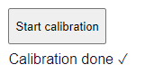

## Analog channels

You can set the analog channel mode and voltage range under "Analog
channels" as shown in\
Figure 7.

Figure 7: channel mode and voltage range

### Channel mode

You can select the channel mode for analog channels as either "Analog
in" or "NTC" (negative temperature coefficient) temperature sensors.

:::warning[Important]

        Do not forget to set the red DIP switch on the
        Uberlogger for the **channel mode** when changing these
        settings

:::

---

### Voltage range

When selecting the mode "Analog in" you can also select the voltage
range "+/- 10V" or "+/- 60V". Note that this is not possible when having
"NTC" selected. Changing the range will give you a higher accuracy when
choosing +/- 10V range or a broader range when selecting + / - 60V.

:::warning[Important]

        Do not forget to set the red DIP switch on the
        Uberlogger for the **voltage range** when changing
        these settings

:::

---

### Setting the channel type and voltage range switches

It is important to manually toggle the switch levers for the voltage
range on the Uberlogger to the setting you set in the configuration,
since this is not detected automatically. You can do this using the red
DIP switches as shown in Figure 8. Set the DIP switches with the
switches facing towards you:

- For NTC, put the lever of the corresponding channel of the left DIP
  switch UP. For analog input, put the channel of the left DIP switch
  DOWN (off).

- For --10V/+10V range put the lever of the corresponding channel of
  the right DIP switch UP (on) and for --60V/+60V set the switch DOWN
  (off)

To save all the settings for the channel configuration, click the "Save
all settings" button.

Figure 8: DIP switches to set the channel mode and voltage range. In
this figure, all channels are set to NTC channels (left DIP switches all
up) with a range of --10V/+10V (right switches all up)

## Analog calibration

To make a zero-offset calibration, make sure you disconnect all the
wires from the inputs, including the temperature sensors. Note that you
cannot do calibration while logging. Put all the DIP switches of the
left DIP switch set to analog IN (down/ "On"). Then, click the "Start
calibration" button under "Analog Calibration", and confirm the message
box that you disconnected the wires and put the DIP switches correct. A
status message shown under the button will show when the calibration is
done.

Figure 9: button to start calibration (left), calibration button with
state under it (right)
