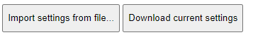

# Configuration

In the user interface portal, you can configure the Uberlogger under the
"Configuration" tab:


## Logger timestamp

The Uberlogger includes a time logging feature in the CSV data format.
You can easily synchronize the Uberlogger\'s internal clock with the
time of the PC or mobile phone you are using to access the interface. It
is important to be aware that the recorded time is stored in Coordinated
Universal Time (UTC) format, without accounting for daylight saving time
adjustments.

## Wi-Fi configuration

The Uberlogger interface is accessed over Wi-Fi. The Uberlogger can
operate in two modes: hotspot mode and hotspot + client mode.

### Hotspot mode


In hotspot mode, you can connect to Uberlogger via any device with an
integrated Wi-Fi adapter and access the control panel through
`<http://192.168.4.1>` via your favourite web browser. Note that using
this mode will disconnect you from the internet while you are connected
to the Uberlogger hotspot. The SSID is of the hotspot will be in the
form of Uberlogger-XXXXXXXX and cannot be changed.

### Hotspot Wi-Fi channel

If you are experiencing connection problems like a slow connection or
lengthy delays, you can try to change the Wi-Fi channel. You can set the
Wi-Fi channel for the hotspot, ranging from channel 1 to 13. By default,
the channel is set to 1.

---

        **Important**: when changing the Wi-Fi channel, you need to
        manually reset the logger to make the setting active.

---

---

### Hotspot + Client mode

In Hotspot + client mode, the Uberlogger will have its hotspot mode
enabled and it can connect to another Wi-Fi network you set. Select
\"Hotspot + Client mode" and fill in the SSID and password of the Wi-Fi
network you want to connect to

+-----------------------------------------------------------------------+
| **Note**: only 2.4GHz networks with WPA2 / WPA3 personal security |
| keys are supported |
| |
| **Note 2**: (open) Wi-Fi networks that require Wi-Fi logon are not |
| supported. |
+=======================================================================+
+-----------------------------------------------------------------------+

Press the \"Save Wi-Fi settings" button to
save the Wi-Fi settings and activate the Wi-Fi mode:


In case when you are connecting to your own Wi-Fi hotspot, you will be
able to access the control panel through `<http://IPADDRESS>`, where
IPADDRESS is the address of the Uberlogger. The link will also be
provided by the Uberlogger when the connection to the Access Point is
successful.

+-----------------------------------------------------------------------+
| **Note:** a minimum Wi-Fi signal strength of -80 dB is required to |
| connect with you Wi-Fi access point |
| |
| **Note 2**: in case the connection fails, and you are not able to |
| connect to your Uberlogger, you can press and hold the "mode" button |
| for 10 seconds to reset the Wi-Fi mode back to Hotspot mode only. |
+=======================================================================+
+-----------------------------------------------------------------------+

## Restore defaults

To restore the default settings of Uberlogger, click the "Restore
default settings" button.


Please note that the default settings are [not] yet saved,
until you hit the "Save all settings\" button:


## Import/export configuration

- You can export the current settings using the "Download current
  settings" button. This will return a JSON file for later use.

```
<!-- -->
```

- You can import the JSON settings file by using the "Import settings
  from file" button. Click on the button, select the exported JSON
  file and the settings will be imported.


