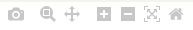

# Live Data viewer

Your Uberlogger is set to display all live data from your channel inputs
by default. If any NTCs are enabled, the temperature will be shown in
degrees Celsius. You can also see live values during logging. Refresh
rates are always limited to 1 Hz.

---

:::info[Note]

When logging data and having a sample frequency of 1, 2 or 5 Hz, it may take up to 70 seconds before data is shown in the live data viewer.

:::

---

Figure 10: on the Live data tab you can see the current data measured by
the Uberlogger. On the right the legend of the channels is shown.

To show or hide signals, click on the signals in the legend to toggle
them on or off. 

Figure 11: in the legend of the live data, you can click on each signal
to show or hide it in the chart.

When you hover of the chart, you see a variety of icons popping up on
the right.

You can zoom and move around the chart as described next.

## Zooming

Box zoom: Click and drag on the plot to draw a rectangle around the area
you want to zoom into the data. You can also click the
 button on the right corner when hovering
over the chart and perform the same action.

Zoom In & Out Buttons: On the top-right corner of the plot, you\'ll find
zoom in and zoom out buttons
 that will zoom in or out incrementally.

## Panning/Scrolling

Drag: Click the pan
button and drag the plot in any direction
to pan through the data. You can also click and hold on the x- or y-axis
and move to the left, right, top or bottom to pan to the direction you
want.

## Reset axis

If you\'ve zoomed in or scrolled and want to get back to the original
view, use the \"Reset Axes\" button
, located in the top-right corner of the
plot.

If you double-click anywhere in the main plotting area, it will reset
the plot to its original view (like the \"Reset Axes\" button). If you
double-click on an axis, it will auto-scale just that axis.

## Snapshot Button

Clicking the camera icon
 will allow you to take a snapshot of
your current plot view and download it as a PNG image.
