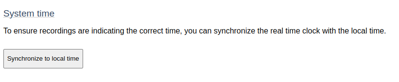

## Synchronizing the time

If you would like to synchronize your Uberlogger\'s time with your local
PC or device you are using, click "Synchronize to local time" 

---

:::info[Note]

Note that the time shown in the user interface is representing the time as the device you are using to control the user interface. The time stored in the CSV is the UTC time, so without time zone and without daylight saving time.

:::

---
