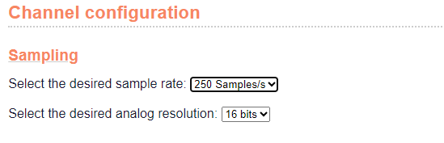

## Setting the sampling frequency and resolution

You can set the sample rate and resolution by going to "Channel
configuration" and selecting the desired sample rate and resolution. To
save the settings, click "Save all settings" or "Save channel settings".

Figure 6: selecting the sample rate and resolution.

## Sampling frequency

The Uberlogger can log input channels at sampling frequencies ranging
from 1 Hz to 250 Hz.

**Choosing the right sampling frequency**

The appropriate sampling frequency for your measurements depends on the
signal you wish to capture accurately. It is recommended to set the
sample rate at least twice the maximum frequency of the signal of
interest. For instance, if your signal\'s highest frequency is 50 Hz,
logging at 100 Hz will prevent aliasing (signal distortion due to a too
low sample rate).

For temperature logging, most applications can achieve satisfactory
results with sampling frequencies as low as 1 Hz or 5 Hz. This ensures
sufficient data points for precise temperature measurements without
significantly increasing data storage requirements.

## Resolution

The Uberlogger can log at 12- or 16-bit resolution.

The 16-bit resolution provides higher precision and sensitivity compared
to 12-bit. This is achieved by internally oversampling the input
channels and applying a first order IIR low-pass filter. This
enhancement is especially advantageous when measuring small variations
or fine details in signals.

:::info[Note]

When utilizing NTC sensors, it is important to be aware that
the resolution for the corresponding channel will be automatically
downscaled to 12-bits. This means that, even if the Uberlogger is set to
16-bit resolution for other channels, the NTC channel will operate at
12-bit resolution.
:::
