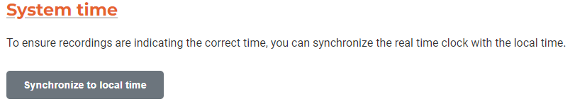
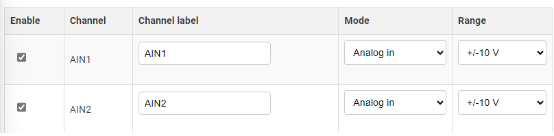
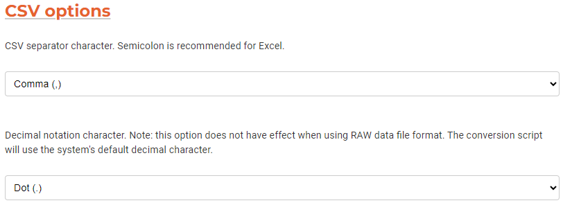
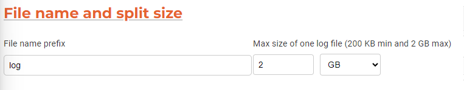
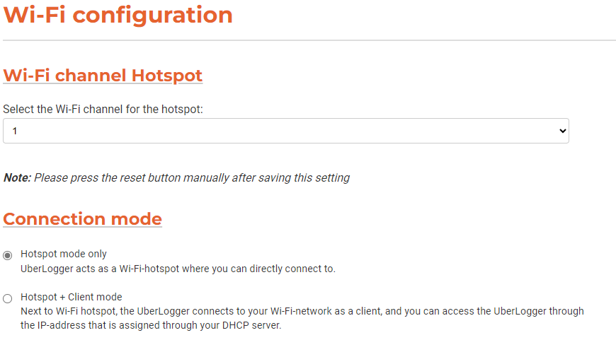

# Configuration

In the user interface portal, you can configure the Uberlogger under the
`Configuration` tab:

## Logger timestamp

The Uberlogger includes a time logging feature in the CSV data format.
You can easily synchronize the Uberlogger's internal clock with the time of the PC or mobile phone you are using to access the interface.

:::note
It is important to be aware that the recorded time is stored in Coordinated Universal Time (UTC) format, without accounting for daylight saving time adjustments.
:::

### Synchronizing the time

If you would like to synchronize your Uberlogger's time with your local
PC or device you are using, click "Synchronize to local time" 

---

:::info Note

The time shown in the user interface is representing the time as the device you are using to control the user interface. The time stored in the CSV is the **UTC time**, so without time zone and without daylight saving time.

:::

---

## Channel configuration

### Sample frequency and resolution

You can set the sample rate and resolution by going to "Channel
configuration" and selecting the desired sample rate and resolution. To
save the settings, click `Save all settings` or `Save channel settings`.

#### Sampling frequency

The Uberlogger can log input channels at sampling frequencies ranging
from 1 Hz to 250 Hz.

**Choosing the right sampling frequency**

The appropriate sampling frequency for your measurements depends on the
signal you wish to capture accurately. It is recommended to set the
sample rate at least twice the maximum frequency of the signal of
interest. For instance, if your signal's highest frequency is 50 Hz,
logging at 100 Hz will prevent aliasing (signal distortion due to a too
low sample rate).

For temperature logging, most applications can achieve satisfactory
results with sampling frequencies as low as 1 Hz or 5 Hz. This ensures
sufficient data points for precise temperature measurements without
significantly increasing data storage requirements.

#### Resolution

The Uberlogger can log at 12- or 16-bit resolution.

The 16-bit resolution provides higher precision and sensitivity compared
to 12-bit. This is achieved by internally oversampling the input
channels and applying a first order IIR low-pass filter. This
enhancement is especially advantageous when measuring small variations
or fine details in signals.

:::info Note

When utilizing NTC sensors, it is important to be aware that
the resolution for the corresponding channel will be automatically
downscaled to 12-bits. This means that, even if the Uberlogger is set to
16-bit resolution for other channels, the NTC channel will operate at
12-bit resolution.
:::

### Analog & digital channels

You can set the analog channel mode and voltage range under "Analog channels" as shown below.

#### Enable channel

You can enable or disable the channel by checking the "Enable" checkbox of the channel.

:::info Note
Enabling/disabling channels is only available from v1.0.4 on.
:::

#### Channel mode

You can select the channel mode for analog channels as either "Analog
in" or "NTC" (negative temperature coefficient) temperature sensors.

:::warning Important
Do not forget to set the red DIP switch on the
Uberlogger for the **channel mode** when changing these
settings
:::

#### Voltage range

When selecting the mode "Analog in" you can also select the voltage
range `+/- 10V` or `+/- 60V`. Note that this is not possible when having
"NTC" selected. Changing the range will give you a higher accuracy when
choosing +/- 10V range or a broader range when selecting + / - 60V.

:::warning Important

Do not forget to set the red DIP switch on the
Uberlogger for the **voltage range** when changing
these settings

:::

#### Setting the channel type and voltage range switches

It is important to manually toggle the switch levers for the voltage
range on the Uberlogger to the setting you set in the configuration,
since this is not detected automatically. Set the DIP switches with the switches facing towards you:

- For NTC, put the lever of the corresponding channel of the left DIP
  switch UP. For analog input, put the channel of the left DIP switch
  DOWN (off).

- For --10V/+10V range put the lever of the corresponding channel of
  the right DIP switch UP (on) and for --60V/+60V set the switch DOWN
  (off)

To save all the settings for the channel configuration, click the "Save
all settings" button.

:::note Dip switches

The DIP switches set the channel mode and voltage range. In this figure, all channels are set to NTC channels (left DIP switches all up) with a range of --10V/+10V (right switches all up)
:::

### Analog calibration

To make a zero-offset calibration, make sure you disconnect all the
wires from the inputs, including the temperature sensors. Note that you cannot do calibration while logging. Put all the DIP switches of the left DIP switch set to analog IN (down/ "On"). Then, click the `Start calibration` button under `Analog Calibration`, and confirm the message box that you disconnected the wires and put the DIP switches correct. A status message shown under the button will show when the calibration is
done.

When the calibration button is pressed, the state of it is shown under it.

## File options

:::info Note
File options are only availabe from firmware v1.0.4 on
:::

### File format

You can choose the file format you want to use for saving your data.

#### CSV

With this option you can directly save your data to a CSV file. In the CSV options section you can also choose which decimal and separator character you want.

#### Raw data

In order to reduce data, you can use the raw data logging option. This will store the data in raw bytes, after which you will need to convert the data to a CSV using the Python conversion script or the Windows conversion tool (both can be found at the [download page](https://wwww.uberlogger.com/support) of Uberlogger.com)

### File name mode

#### Sequential

With sequential file name mode, the log file names are written as prefix + sequence number. For example, if the prefix is "log", the file names will be "log0", "log1" etc. The Uberlogger will look for the first available sequential file name available.

:::warning Attention
When logging, existing file names will be overwritten. For example, if log1.csv does not exist, but log2.csv does, then log1.csv will be written first until the split size (see section below) is reached. Then log2.csv will be overwritten.
:::

#### Timestamp

With the timestamp mode, the file name will have the form YYYYMMDD_HH-MM-ss-Prefix. For example: 20240322_15-05-10. The timestamp will be based on **UTC Time** that is set on the Uberlogger.

### CSV options

One can adjust the decimal and separator character. The separtor character will also be taken into consideration when using the raw data conversion script or tool.

#### Separator character

Choose between comma (',' default) or semicolon (';'). Semicolon is recommended when using the CSVs for Excel.

#### Decimal notation character

Choose either dot ('.' default) or comma (','). Note: this option does not have effect when using raw data file logging.

### File name and split size

By default, the Uberlogger will use your prefix for the file name and the log files will be split in parts. The size of the log file can be set from 200 KB to 2 GB.

:::info Note
Note that the file size is approximately the set split size and not exact.
:::

## Wi-Fi configuration

The Uberlogger interface is accessed over Wi-Fi. The Uberlogger can
operate in two modes: hotspot mode and hotspot + client mode.

### Hotspot mode

In hotspot mode, you can connect to Uberlogger via any device with an
integrated Wi-Fi adapter and access the control panel through
`<http://192.168.4.1>` via your favourite web browser. Note that using
this mode will disconnect you from the internet while you are connected
to the Uberlogger hotspot. The SSID is of the hotspot will be in the form of `Uberlogger-XXXXXXXX` and cannot be changed.

### Hotspot Wi-Fi channel

If you are experiencing connection problems like a slow connection or
lengthy delays, you can try to change the Wi-Fi channel. You can set the
Wi-Fi channel for the hotspot, ranging from channel 1 to 13. By default,
the channel is set to 1.

:::caution Important
When changing the Wi-Fi channel, you need to manually reset the logger to make the setting active.
:::

### Hotspot + Client mode

In Hotspot + client mode, the Uberlogger will have its hotspot mode enabled and it can connect to another Wi-Fi network you set. Select `Hotspot + Client mode` and fill in the SSID and password of the Wi-Fi network you want to connect to:

:::info Note

- only 2.4GHz networks with WPA2 / WPA3 personal security keys are supported
- (open) Wi-Fi networks that require Wi-Fi logon are **not** supported.

:::

Press the `Save Wi-Fi settings` button to save the Wi-Fi settings and activate the Wi-Fi mode:

In case when you are connecting to your own Wi-Fi hotspot, you will be able to access the control panel through `<http://IPADDRESS>`, where `IPADDRESS` is the address of the Uberlogger. The link will also be provided by the Uberlogger when the connection to the Access Point is
successful.

:::info Note

- A minimum Wi-Fi signal strength of -80 dB is required to connect with you Wi-Fi access point

:::

### Unable to connect to Uberlogger via access point

In case the connection fails, and you are not able to connect to your Uberlogger with your access point, try to connect directly to the Hotspot SSID described earlier. You can also press and hold the "mode" button for 10 seconds to reset the Wi-Fi mode back to Hotspot mode only.

## Restore defaults

To restore the default settings of Uberlogger, click the "Restore
default settings" button.

Please note that the default settings are **not** yet saved,
until you hit the `Save all settings` button:

## Import/export configuration

- You can export the current settings using the "Download current
  settings" button. This will return a JSON file for later use.
- You can import the JSON settings file by using the "Import settings
  from file" button. Click on the button, select the exported JSON
  file and the settings will be imported.

