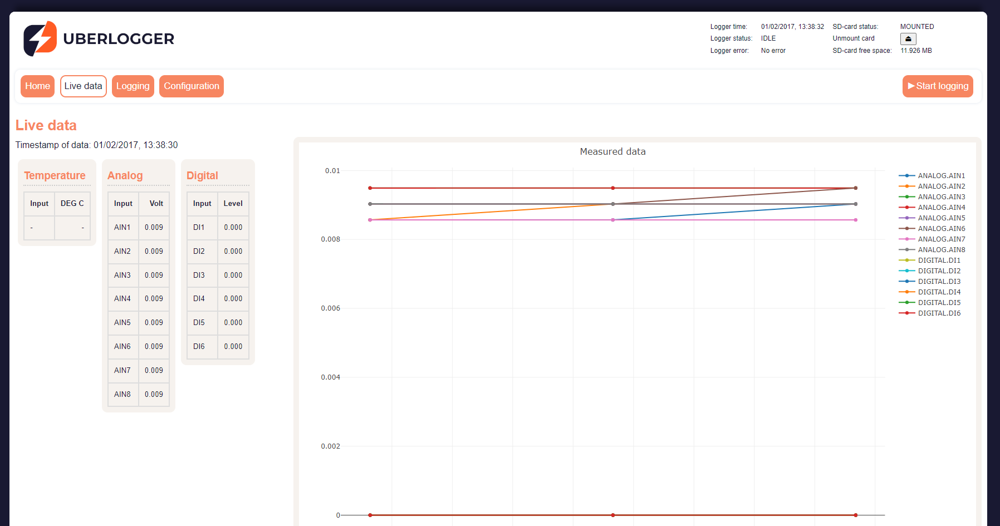
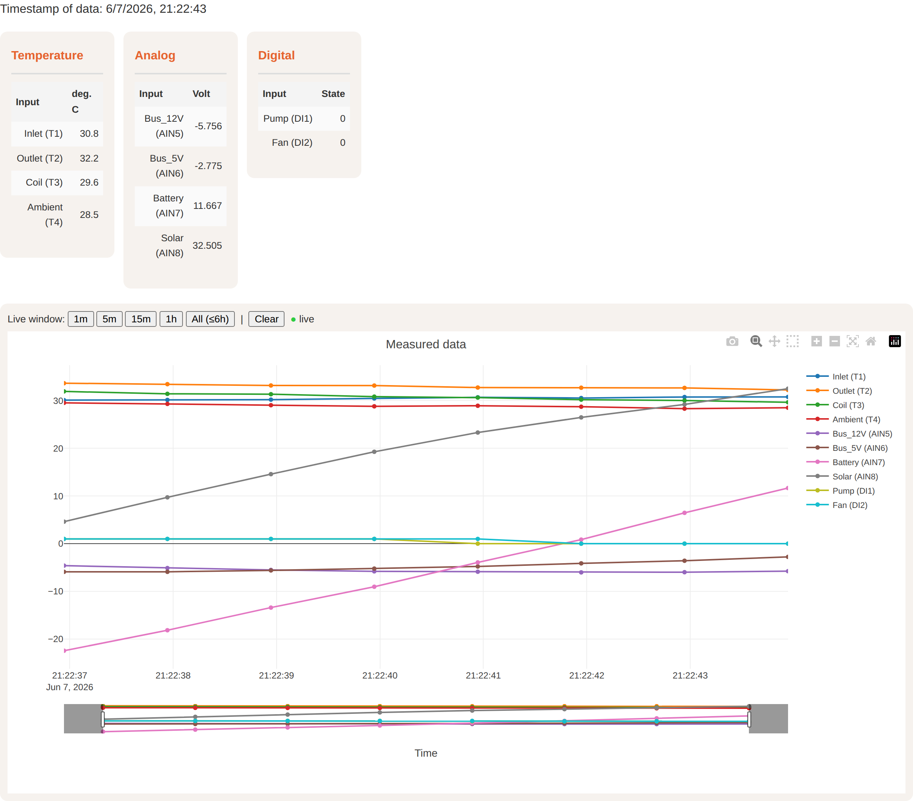
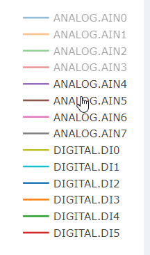
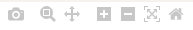
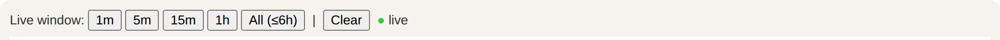

# Live Data viewer

Your Uberlogger is set to display all live data from your channel inputs
by default. If any NTCs are enabled, the temperature will be shown in
degrees Celsius. You can also see live values during logging. Refresh
rates are always limited to 1 Hz.

---

:::info Note

When logging data and having a sample frequency of 1, 2 or 5 Hz, it may take up to 70 seconds before data is shown in the live data viewer.

:::

---

On the Live data tab you can see the current data measured by
the Uberlogger. On the right the legend of the channels is shown. To show or hide signals, click on the signals in the legend to toggle
them on or off.

From firmware **v1.3.3** on, channels you have labelled in the
[Configuration](../03-Configuration/index.md) are shown by their label
(for example `Inlet (T1)`) in both the legend and the value list. Hover a
signal on the chart to read its exact value at the cursor; crosshair lines
mark the corresponding time and value on the axes.

When you hover over the chart, you see a variety of icons popping up on
the right.

You can zoom and move around the chart as described next.

## Zooming

Box zoom: Click and drag on the plot to draw a rectangle around the area
you want to zoom into the data. You can also click the
 button on the right corner when hovering over the chart and perform the same action. Zoom In & Out Buttons: On the top-right corner of the plot, you'll find zoom in and zoom out buttons
 that will zoom in or out incrementally.

## Panning/Scrolling

Drag: Click the pan
button and drag the plot in any direction
to pan through the data. You can also click and hold on the x- or y-axis
and move to the left, right, top or bottom to pan to the direction you
want.

## Reset axis

If you've zoomed in or scrolled and want to get back to the original
view, use the "Reset Axes" button
, located in the top-right corner of the plot. If you double-click anywhere in the main plotting area, it will reset
the plot to its original view (like the "Reset Axes" button ). If you
double-click on an axis, it will auto-scale just that axis.

## Snapshot Button

Clicking the camera icon
 will allow you to take a snapshot of
your current plot view and download it as a PNG image.

## Live time window

From firmware **v1.3.2** on, a row of buttons above the chart
(**1m / 5m / 15m / 1h / All**) sets how much recent history is shown. The
chart follows the newest data ("live"); zooming or panning pauses
following, and double-clicking the plot (or picking a window) resumes it.
A small indicator next to the buttons shows whether the chart is
**live** or **paused**. "All" shows the full retained history, up to a
maximum of about 6 hours.

## Data history

The live chart keeps roughly the last **6 hours** of data per channel.
This history is stored in your browser, so it **survives a page refresh**
and keeps accumulating even while you are on other tabs (File browser,
Configuration, etc.) — you no longer lose the chart by navigating away or
reloading.

## Clearing the chart

Use the **Clear** button above the chart to empty the stored history and
start the live view from scratch. New samples begin filling the chart
again immediately.

## Connection indicator

The status dot next to the time-window buttons reflects the live
connection to the Uberlogger: it is **green** while data is being
received and turns **red** ("connection lost") if the browser can no
longer reach the device.
