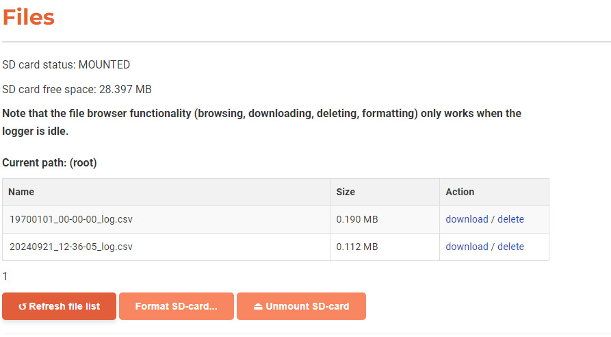

# File browser

You can browse, download and delete files in the file browser. This requires the SD-card to be inserted and mounted in the Uberlogger.

:::note Note

You can only use the file browser, format and Unmount SD-card buttons while the Uberlogger is idle, so not logging, calibrating or formatting the SD-card.
:::

:::

By default, the last available page in the file list is shown with the latest files at the bottom. Download files by clicking on `Download` and delete them with `delete` using the links indicated in the row next to the filename.

## Formatting SD-card

To format the SD-card you can click the `Format SD-card` button. Formatting of the SD-card may take up 30 seconds and currently no feedback is given when done.

## Unmount SD-card

You can unmount the SD-card with the `Unmount SD-card` button. This will safely unmount the SD-card after you can take it out of the Uberlogger. To remount the SD-card, simply take it out of the Uberlogger and reinsert it.
