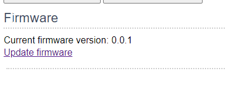
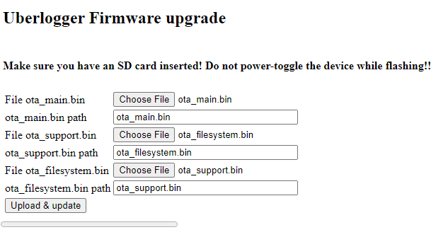
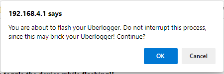
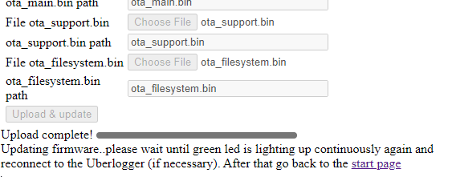

# Firmware update

You can update the firmware by clicking on "Firmware update" at the
bottom of the Configuration page. You download the latest firmware on
the website of Uberlogger:
[www.Uberlogger.com](http://www.uberlogger.com)/support. To update the
firmware, follow the next steps:

:::note Step 1

- Extract the zip with the firmware files into a directory.
- Go to "Update firmware" under "Configuration":

:::

:::note Step 2

- Select the ota_main.bin, ota_support.bin and ota_filesystem.bin files for the appropriate inputs:

:::

:::danger Important
Before continuing, make sure that you do not
interrupt the update process! This may brick your device!

:::

:::note Step 3

- Click "Upload & update" to and confirm the next message with "OK" to start the update process.

- Note that the green LED on the Uberlogger is blinking fast while
  updating. Please wait for about 60 seconds before the system is done
  and the green LED is continuously on again.

:::

:::note Step 4

- Screen should show `Upload complete!` when successfully
  updating the firmware.
- Check that the green LED is turned on constantly again. After this,
  you can connect to the Uberlogger again and click the start page
  link.
  :::
