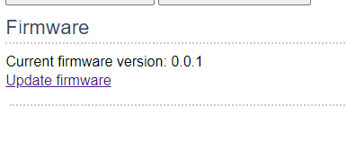
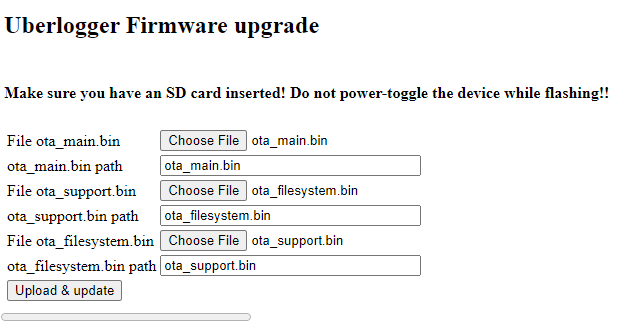
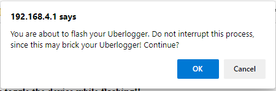
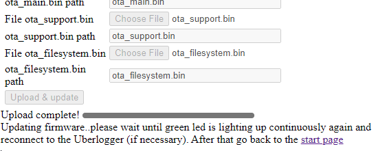

# Firmware update

From firmware v1.3.0 on, firmware updates are performed from the
dedicated **Firmware Update** tab in the web interface (older firmware
hosted the same controls at the bottom of the Configuration page).
Download the latest firmware from the Downloads section on the
Uberlogger website:
[www.uberlogger.com/#downloads](https://www.uberlogger.com/#downloads).

A firmware release ships as a zip file containing three binaries that
must all be flashed together:

- **`ota_main.bin`** — ESP32 main application (web server, logger
  logic, REST API).
- **`ota_support.bin`** — STM32 support-chip firmware (ADC sampling,
  digital inputs, RTC).
- **`ota_filesystem.bin`** — SPIFFS filesystem image containing the
  web-interface assets (HTML/CSS/JS).

To update the firmware, follow the next steps:

:::note Step 1

- Extract the zip with the firmware files into a directory.
- In the web interface, open the **Firmware Update** tab.

:::

:::note Step 2

- Select the `ota_main.bin`, `ota_support.bin` and `ota_filesystem.bin`
  files for the matching inputs.

:::

:::danger Important
Before continuing, make sure that you do not interrupt the update
process or power-cycle the device! This may brick your Uberlogger.

Active logging is paused for the duration of the update.
:::

:::note Step 3

- Click `Upload & update` and confirm the message with `OK` to start
  the update process.

- The page shows live per-file progress bars while each binary is
  uploaded and flashed.
- The green LED on the Uberlogger blinks fast while the update is in
  progress. The full update typically takes around 60 seconds.
- After flashing, the device reboots automatically. The page polls the
  device for up to two minutes and reports success as soon as it comes
  back online.

:::

:::note Step 4

- The page reports `Upload complete!` (or an equivalent success
  message) once the device is back online with the new firmware.
- Check that the green LED is constantly on again. If the device fails
  to come back online within the polling deadline, power-cycle the
  Uberlogger and verify the firmware version under the **System**
  sub-tab of the Configuration page.

:::

:::info Note
If a previously configured web-interface login is enabled, the browser
may prompt you to re-authenticate after the device has rebooted.
:::
